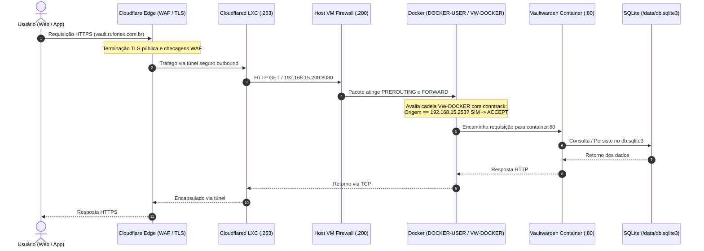

# Diagrama de Arquitetura — Vaultwarden

Este documento apresenta o fluxo de comunicação de ponta a ponta e a topologia de isolamento da infraestrutura do Vaultwarden.

---

## Fluxo Textual de Acesso

```text
       [ Internet ]
            |
            v
     [ Cloudflare ]
  (DNS Anycast / TLS / WAF)
            |
            v
   [ Cloudflare Tunnel ]
  (Túnel seguro outbound)
            |
            v
   [ Cloudflared LXC ]
     (192.168.15.253)
            |
       HTTP :8080 (LAN privada)
            |
            v
  [ 192.168.15.200:8080 ]
  (VM Vaultwarden - ens18)
            |
            v
 [ DOCKER-USER / VW-DOCKER ]
(Filtro iptables via conntrack)
 (Permite apenas 192.168.15.253)
            |
            v
 [ Vaultwarden container ]
     (Porta interna :80)
            |
            v
  [ /opt/vaultwarden/data ]
     (Bind mount no host)
            |
            v
        [ SQLite ]
   (/data/db.sqlite3)
```

---

## Diagrama Detalhado de Componentes e Redes

```text
=============================================================================================
EXTERNO (WAN)
  Cliente Bitwarden (Web Vault / Extensão Navegador)
       │
       ▼ HTTPS (TCP/443)
  Cloudflare Edge (vault.rufonex.com.br)
  - Terminação TLS pública
  - Proteção DDoS e WAF
=============================================================================================
       │
       │ (Túnel Outbound Seguro - Cloudflare Tunnel)
       ▼
=============================================================================================
REDE LOCAL (LAN 192.168.15.0/24) / HYPERVISOR PROXMOX VE

  ┌─────────────────────────────────────────────────────────────┐
  │ LXC: Cloudflared (192.168.15.253)                           │
  │ - Conexão gerenciada por token (/etc/cloudflared/token)     │
  │ - Ingress origin: http://192.168.15.200:8080                │
  └──────────────────────────────┬──────────────────────────────┘
                                 │
                                 │ HTTP (TCP/8080)
                                 ▼
  ┌────────────────────────────────────────────────────────────────────────────────────────┐
  │ VM Dedicada: Vaultwarden (192.168.15.200)                                              │
  │ SO: Debian GNU/Linux 13 (trixie) | Kernel: 6.12.107+deb13-amd64                        │
  │ Interface: ens18 | Gateway: 192.168.15.1                                               │
  │                                                                                        │
  │ [ Firewall do Host (iptables-nft / netfilter-persistent) ]                              │
  │  - INPUT: DROP (Permite SSH TCP/22 apenas de 192.168.15.0/24)                          │
  │  - FORWARD: DROP                                                                       │
  │  - IPv6: DROP para tráfego de entrada não solicitado (SSH IPv6 bloqueado)              │
  │                                                                                        │
  │ [ Cadeia Docker de Filtragem (iptables) ]                                              │
  │    PREROUTING (nat DNAT para bridge do container)                                      │
  │        │                                                                               │
  │        ▼                                                                               │
  │    FORWARD ──► DOCKER-USER ──► VW-DOCKER                                               │
  │                                   ├── ESTABLISHED,RELATED ──► ACCEPT                   │
  │                                   ├── Origem 192.168.15.253 + ctorigdst :8080 ──► ACCEPT│
  │                                   ├── Outras origens + ctorigdst :8080 ──► DROP        │
  │                                   └── Outros pacotes ──► RETURN                        │
  │                                                                                        │
  │ [ Docker Engine 29.8.1 / Bridge Network: vaultwarden_net ]                             │
  │  - daemon.json: log-driver local, rotação 20MB x 5, live-restore                       │
  │  - Binding: 192.168.15.200:8080 -> container:80                                        │
  │                                                                                        │
  │  ┌──────────────────────────────────────────────────────────────────────────────────┐  │
  │  │ Container: vaultwarden (v1.37.3 - Digest sha256:4ecafc90...)                      │  │
  │  │ - security_opt: no-new-privileges:true                                           │  │
  │  │ - restart: unless-stopped                                                        │  │
  │  │ - healthcheck: endpoint /alive (HTTP 200)                                        │  │
  │  │ - bind mount: /opt/vaultwarden/data -> /data                                     │  │
  │  └──────────────────────────────┬───────────────────────────────────────────────────┘  │
  │                                 │                                                      │
  │                                 ▼                                                      │
  │  [ Sistema de Arquivos Persistente (/opt/vaultwarden/data) ]                           │
  │   - db.sqlite3 (Banco SQLite)                                                          │
  │   - rsa_key.pem (Chave RSA da instância)                                               │
  │   - icon_cache/                                                                        │
  │                                 │                                                      │
  │                                 ▼                                                      │
  │  [ Rotina de Backup Local (/usr/local/sbin/vaultwarden-backup) ]                       │
  │   - docker exec vaultwarden /vaultwarden backup (Checkpoint SQLite limpo)              │
  │   - Parada limpa do container                                                          │
  │   - Empacotamento /opt/vaultwarden/data em /var/backups/vaultwarden/*.tar.gz           │
  │   - Geração e validação de hash *.sha256 + teste de leitura tar                        │
  │   - Reinício do container com monitoramento de /alive                                  │
  └────────────────────────────────────────────────────────────────────────────────────────┘
=============================================================================================
```

---

## Diagrama de Sequência de Ingress


